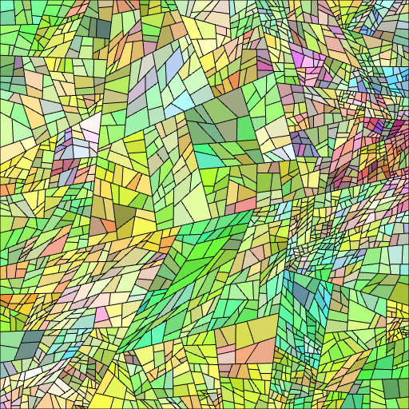
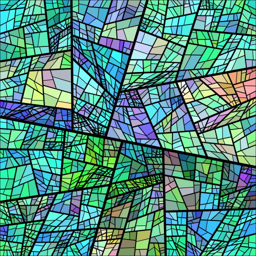

# tessellation-webgl
Tessellation is the process of partitioning space into a set of smaller polygons.

This project aims at creating interesting scenes by using iterative tessellation and coloring. Each scene is completely random and supports infinite zooming. You can explore anywhere you like by using the left mouse button.

Unfortunately, WebGL doesn't support geometry nor tessellation shaders. I perform the tessellation itself is CPU-side and monothreaded, however for good real-time performance during zooming, a big part of the computation is delegated to the GPU.

See it live [here](https://piellardj.github.io/tessellation-webgl/).

## Preview

## Explanations
### Base idea

The principle of tessellation I use here is very basic: to tessellate a shape (quad or triangle), I simply compute a random segment that splits the shape in two subshapes. Then, repeat the process on each subshape as many times as needed. Each subshape inherit the color of their parent, with a slight mutation.

When zooming in, when needed I tessellate again each child shape in order to maintain a pretty constant number of shapes on screen.

### Implementation

#### Tree structure
The natural structure of the scene is tree-like, where each tree node is a shape that has its subshapes as children. Only the leafs of the tree are displayed as polygons (when soft blending is enabled, I first display the leafs' parents as opaque shapes, then the leafs are displayed as semi-transparent). For lines, I display every subdivision segment in the tree.

##### Tree optimization: size reduction
The first optimization is to reduce the size of the tree as much as possible, because it reduces memory and CPU footprint, and it also reduces the amount of primitives to draw.

In this regard, the tree has 2 interesting properties.

The first property is: a child node's space is contained in its parent's space. This means that if a parent is out of view, then all of its children are out of view too.
- This project supports zooming in the scene, and not zooming out. This means that regularly, primitives go out of view and will be seen again. They can safely be trimmed from the tree. To do so, I perform a depth-first search in the tree. Starting from the root node:
    - if the current node is out of view, itself and its subtree can be removed from the tree,
    - otherwise, I go deeper check the subnodes because some of them might be out of view.

The second property is: siblings' space form a partition of their parent's space. This means that siblings' space don't intersect. If a node covers the whole screen, it means that all its siblings are out of view.
- In order to reduce the total depth of the tree, I regularly check if the one of the root node's direct children covers the whole screen. If such a child exists, it means that the root node only has one useful child left. In this case, the root node is replaced by its child, reducing the depth of the tree by one.

##### Tree optimization: levels cache
I often need to iterate over the nodes of the tree. Especially, I regularly need to iterate over all nodes of a given depth. Doing this naively requires lots of going up and down in the tree.

Each node has a cache dedicated for this use case. Each node has several lists: a list of its children of depth 1 (direct children), 2 (grand-children), 3 etc. When a node is added to or removed from the tree, its parents are notified that their cache has been invalidated. It will be reconstructed the next time it will be needed. This is quite memory intensive because it does a lot of Array.push(). I found that Array.push() is faster than Array.concat(), maybe because the latter creates a whole new array while the first one edits an existing one.

#### Computation optimizations
The CPU-side computations are made of 3 things:
- applying the zoom to all primitives: this requires iterating over the vertices of dozens of thousands of primitives, which takes a bit of time since Javascript is monothreaded.
- pruning subtrees that went out of view,
- adding a new depth level in the tree by subdividing every leaf.

These computations are too heavy on the CPU and memory to be performed on each frame. This is why I only perform them on a regular basis, for instance every 100 milliseconds. However, I still want the zooming animation to be smooth. So, for each frame between two heavy CPU computations, the GPU interpolates the position of each primitive according to the current zooming speed. This way of delegating computation to the GPU works very well for my needs.

#### Rendering
This project supports 3 custom renderers:
 - for downloading the result I use a SVG renderer. Performance doesn't matter here.
 - for real-time rendering, I implemented both a Canvas2D renderer and a WebGL renderer. As expected, the Canvas2D one is simple to implement but really slow. Only the WebGL renderer, with a few optimizations, offers the performance I need.

##### WebGL renderer optimizations
In WebGL, I often find the costliest operation is the CPU/GPU communication. This includes two things:
- CPU-side building of VBOs and their upload on the GPU
- calls to APIs such as `setUniform`, `bindArray`, `drawArray` etc.

In order to reduce both, my WebGL renderer waits until the last moment to draw everything. This allows me only rebuild and reupload VBOs when their data has changed, and also to blend calls to `drawArrays` together when they use continuous VBO subparts and the same uniform values.

##### Antialiasing differences between Canvas2D and WebGL
By comparing my SVG, Canvas2D and WebGL renderers I noticed a difference in the way shapes are rendered. Here is an illustration:

    
    

        <i>WebGL renderer on the left, Canvas2D on the right. The scene is the same: polygons only, without any lines, drawn over a black background.</i>
    

Notice how the result is different: in the WebGL version, each polygon touches its neighbours, whereas in the Canvas2D/SVG version there is a kind of gap creating unwanted lines between neighbours.

It seems that the difference comes from the handling of antialiasing:
- in WebGL, the antialiasing is performed a posteriori: the scene is drawn aliased, and then it is antialiased as a whole
- in Canvas2D/SVG, the antialiasing is performed independently on each shape, and then the final result is computed by blending all antialiased shapes together.

This can be confirmed by using the SVG attribute `shape-rendering="crispEdges"`, which basically disables antialiasing. By using this attribute, the ugly lines artifacts disappear, but then the scene is aliased. I suspect there is a similar attribute for Canvas2D, but I didn't bother searching.

    
    

        <i>x3 magnification of the same SVG scene made of triangles that touch their neighbours. On the left, with default parameters: antialiased but with ugly lines artifacts. On the right, with <code>shape-rendering="crispEdges"</code> parameter: no artifact but the scene is aliased.</i>
    

